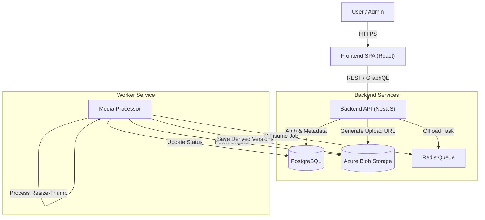

# Digital Media Library - Analysis & System Design

## 1. Analysis and Explanation of Requirements

### Core Problem
The organization is currently suffering from **"Content Chaos"** in SharePoint.
*   **Duplication:** The same files exist in multiple places, wasting storage and cost.
*   **Unfindable Content:** Finding a specific image/video is hard because files are poorly named and scattered in deep folder structures.
*   **Risky Sharing:** Users have to share entire folders to share a single file, which exposes internal data to external parties insecurely.

### Key Objectives (What we must achieve)
1.  **"Single Source of Truth":** Eliminate duplicates. If a file is in two albums, it should just be two references to the *same* physical file.
2.  **"Google-like" Search:** Users should find files by Country, Type, or Tags, not just by clicking through 10 layers of folders.
3.  **"Dropbox-style" Sharing:** Share specific items via a secure link that expires, without giving access to the underlying folder.

### The Workflow "Mental Model"
The system introduces a strict workflow to keep data clean:
1.  **Ingest:** Upload raw files (Images/Videos).
2.  **Curation (The Gatekeeper):** Before files enter the library, they *must* be reviewed. Users apply Usage Rights, Tags, and Rename them in a "Holding Area" (Batch Preview).
3.  **Publish:** Confirmed files enter the main Library.
4.  **Discovery:** Users find content via Search or curated Albums.
5.  **Distribution:** Controlled sharing via expired links.

---

## 2. Proposed Solution & System Design

### 2.1 High-Level Architecture
We will use a **Modular Monolith** or **Microservices** architecture (depending on scale, but Monolith is likely sufficient for Phase 1) with a clear separation of concerns.

**Components:**
1.  **Client Application (SPA):** A responsive web app for users to browse, upload, and curate.
2.  **API Gateway / Backend Server:** Handles business logic, permissions, and orchestrates dataflow.
3.  **Worker Service (Background Jobs):** Crucial for heavy lifting—processing images, resizing, and video transcoding without slowing down the user experience.
4.  **Data Persistence:**
    *   **Relational DB:** For metadata, relationships, and permissions.
    *   **Object Storage:** For the actual image/video files (Blob storage).

### 2.2 Technology Stack Recommendation

**Option 1: Node.js Ecosystem (Recommended for Real-time)**
*   **Frontend:** `React` (or `Next.js`) + `TailwindCSS`.
    *   *Why:* Rich interactive UI needed for "Batch Curation" (drag-select, bulk edit).
*   **Backend:** `Node.js` with `NestJS`.
    *   *Why:* Strong typing (TypeScript), great module structure, easy integration with Queues.
*   **Database:** `PostgreSQL`.
    *   *Why:* Complex relationships (Albums <-> Media, Users <-> Permissions) require a relational model.
*   **Storage:** `Azure Blob Storage` (as requested) or `AWS S3`.
*   **Queue/Processing:** `BullMQ` (Redis) + `Sharp` (Image processing) + `FFmpeg` (Video processing).

**Option 2: PHP Ecosystem (Laravel)**
*   **Frontend:** `Vue.js` (via Inertia.js) or `React` + `TailwindCSS`.
*   **Backend:** `Laravel` (PHP).
    *   *Why:* Fast development speed, built-in robust features (Queue system, File Storage abstraction `flysystem`, Authentication).
*   **Database:** `MySQL` or `PostgreSQL`.
*   **Queue/Processing:** `Laravel Horizon` (Redis) + `GD/Imagick` (Image) + `FFmpeg`.

### 2.3 System Architecture Diagram

### 2.4 Key Design Decisions

#### A. Handling Large Uploads (The "Direct Upload" Pattern)
To handle 150MB+ files efficiently, we should **not** stream files through the Node.js backend server.
1.  **Request:** Frontend asks API for a "Presigned URL" (SAS Token).
2.  **Upload:** Frontend uploads file *directly* to Azure Blob Storage using that URL.
3.  **Confirm:** Frontend tells API "Upload Complete".
4.  **Process:** API triggers a background job to scan/process the file.

#### B. The "Batch Curation" Stage (State Machine)
We need a robust state machine for Media Items:
*   `DRAFT`: Uploaded but not confirmed (sat in the "Curation" screen).
*   `PROCESSING`: Worker is generating thumbnails.
*   `ACTIVE`: Live in the library.
*   `ARCHIVED`: Cold storage / Soft deleted.

The "Batch Preview" UI will query items in `DRAFT` state for the current user's session.

#### C. Sharing & Security Architecture
*   **Internal Access:** Controlled by `RBAC` (Role-Based: Admin, Member) and `ACL` (Access Control List: "User X has access to Album Y").
*   **External Access (Share Links):**
    *   We create a `ShareLink` entity with a unique `token` (UUID).
    *   Middleware validates: `exists(token)` AND `!expired(token)` AND `!revoked`.
    *   *Security:* The actual file URL is never exposed directly. The API proxies the download stream OR generates a short-lived (5 min) SAS token for the browser to download.

### 2.5 Database Schema Design (Simplified)

*   `users`: (id, email, role)
*   `folders`: (id, name, parent_id, path_enumeration)
    *   *Optimized for tree traversal.*
*   `albums`: (id, folder_id, owner_id)
*   `media_items`: (id, album_id, storage_key, type, status, metadata_json)
*   `media_versions`: (id, media_item_id, type, storage_key)
    *   *Stores "Thumbnail", "Medium", "Large", "Crop1"*
*   `permissions`: (id, entity_type, entity_id, user_id, access_level)
*   `share_links`: (id, token, expires_at, is_revoked)
*   `share_link_items`: (share_link_id, media_item_id)

### 2.6 Implementation Roadmap (Phase 1)
1.  **Foundation:** Setup Next.js, NestJS, Postgres, and Docker.
2.  **Storage Engine:** Implement "Direct Upload" to Azure/S3.
3.  **Media Processing:** Build the Worker for thumbnails (using `Processors` pattern).
4.  **Core Library:** Implement Folders, Albums, and Media List APIs.
5.  **Curation UI:** Build the Batch Preview interface (complex frontend work).
6.  **Sharing:** Implement the Public Share Link logic.

---

## 3. Data Warehouse & ERP Strategy

### 3.1 Design Philosophy: "Assets as Inventory"
To implement this like an ERP (Enterprise Resource Planning), we treat every digital file as an **Inventory Item**.
*   **Stock:** How many assets do we have? (Count)
*   **Cost:** How much storage creates cost? (Size in GB)
*   **Turnover:** How often is an asset used? (Downloads/Views)
*   **Depreciation:** Is the asset too old (Lifecycle/Archival)?

### 3.2 Key Function for Processing
The most critical function in this architecture is the **ETL Pipeline (Extract, Transform, Load)** or **"The Ledger Sync"**.
*   **What it does:** It runs nightly (or real-time stream) to aggregate raw operational logs into business intelligence.
*   **Why it works:** It decouples *Operational Performance* (User clicking download) from *Analytical Performance* (Manager querying "Marketing's storage usage in 2024").

### 3.3 Data Warehouse Schema (Star Schema)
We serve analytics using a Star Schema optimized for OLAP (Online Analytical Processing).

#### Fact Tables (The "Events")
1.  **`fact_media_usage`**: Records every interaction.
    *   `usage_id` (PK)
    *   `media_id` (FK) -> `dim_media`
    *   `user_id` (FK) -> `dim_user`
    *   `time_id` (FK) -> `dim_time`
    *   `action_type` (Enum: VIEW, DOWNLOAD, SHARE, DELETE)
    *   `bytes_transferred` (BigInt) - *For bandwidth cost calculation.*

2.  **`fact_storage_snapshot`**: efficient daily snapshots for cost trends.
    *   `snapshot_id` (PK)
    *   `time_id` (FK)
    *   `department_id` (FK)
    *   `total_files_count` (Int)
    *   `total_size_gb` (Decimal)
    *   `cold_storage_gb` (Decimal)

#### Dimension Tables (The "Context")
*   **`dim_time`**: `date`, `month`, `year`, `quarter`, `is_weekend` (Critical for ERP reporting periods).
*   **`dim_media`**: `media_id`, `type` (Video/Image), `country`, `project_code`, `category`.
*   **`dim_user`**: `user_id`, `department`, `role`, `location`.
*   **`dim_cost_center`**: `department_code`, `budget_limit`.

### 3.4 Operational Reports (ERP Style)
1.  **Cost Allocation Report:**
    *   *Formula:* `(Dept Usage GB * $CostPerGB) + (Bandwidth * $CostPerTransfer)`
    *   *Usage:* Chargeback to Marketing/Sales departments based on actual usage.
2.  **Asset Utilization Report (Inventory Turnover):**
    *   Identify "Dead Stock": Files uploaded > 1 year ago with 0 downloads.
    *   *Action:* Auto-move to Cold Storage (Archive) to save money.
3.  **Compliance & Audit Trail:**
    *   Full history of who shared what externally.
    *   "Who deleted the project folder?" - Traceable via Audit Log integrated into DW.
